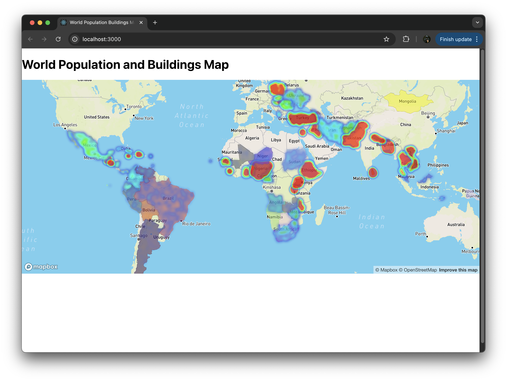

# World Population and Building Density Map

## Overview
This project visualizes the relationship between population density, area, and building density for countries around the world using Mapbox and Turf.js. It fetches and displays data such as population, area, and building polygons to create heatmaps for insights.

## Features
- Visualizes population density heatmaps for countries.
- Displays random color fills for countries without heatmap data.
- Dynamically fetches population and area data using APIs.
- Uses Turf.js to generate points for heatmap visualization.
- Allows integration of building polygons to analyze their relation with population density.

## Installation

1. **Clone the Repository**
   ```bash
   git clone https://github.com/Ruthik27/World-Population-and-Buildings-Map
   cd World-Population-and-Buildings-Map
   ```

2. **Install Dependencies**
   Ensure you have Python installed. Use the `requirements.txt` file to install Python dependencies:
   ```bash
   pip install -r requirements.txt
   ```

3. **Install Node.js Dependencies**
   ```bash
   npm install
   ```

4. **Set Environment Variables**
   Create a `.env` file in the root directory and add the following:
   ```env
   REACT_APP_MAPBOX_ACCESS_TOKEN=<your_mapbox_access_token>
   REACT_APP_OPEN_BUILDINGS_API_KEY=<your_open_buildings_api_key>
   ```

5. **Start the Server**
   ```bash
   node server.js
   ```

6. **Run the Frontend**
   ```bash
   npm start
   ```

## Usage
- The map will load and display countries with heatmaps and fill colors.
- You can zoom in to see more details about population density and relations.



## Folder Structure
```
root
├── App.js              # React application entry
├── Map.js              # Map visualization logic
├── server.js           # Backend server for API calls
├── requirements.txt    # Python dependencies
├── .env                # Environment variables
├── package.json        # Node.js dependencies
├── public/             # Static assets
├── src/                # React components
└── README.md           # Documentation
```

## Future Work

1. **Detailed View of Administrative Levels**
   - Convert each country's administrative boundaries into sub-administrative levels.
   - Fetch and display population metrics for each sub-administrative level.

2. **Integration of Building Polygons**
   - Add detailed building polygons.
   - Show relationships between area, population density, and building density in visualizations.

3. **Performance Enhancements**
   - Optimize API calls and data fetching to handle larger datasets efficiently.
   - Improve map rendering for better performance on lower-end devices.

4. **Enhanced User Interactivity**
   - Add click events for detailed country and sub-region insights.
   - Allow toggling between different data layers, such as population, area, and buildings.

5. **Data Export Options**
   - Provide options to download data visualizations as images or reports.

6. **Analytics and Insights**
   - Add a dashboard for aggregate statistics and trend analysis.

## Contributing
Contributions are welcome! Please fork the repository and create a pull request with your changes.

## License
This project is licensed under the MIT License. See the LICENSE file for details.

## Contact

Project Link: [https://github.com/Ruthik27/World-Population-and-Buildings-Map](https://github.com/Ruthik27/World-Population-and-Buildings-Map)

## Support


---

https://www.cviog.uga.edu/information-technology/
